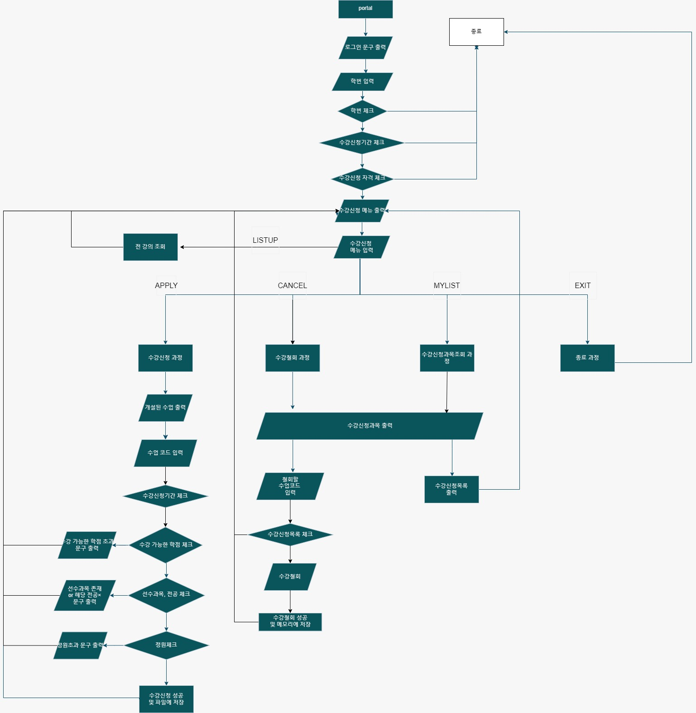

# oop2-oops-enrollment
### 자바의 tcp서버와 tcp클라이언트의 소켓 통신을 활용한 수강신청 프로그램입니다
  

## 기능
* 클라이언트 즉 사용자는 수강신청, 수강철회, 수강신청목록을 조회할 수 있습니다.
* 서버와 클라이언트간의 합의된 명령어를 사용하여 요청과 응답을 주고 받습니다.
* String메시지를 파싱하여 명령어와 값을 구분합니다.
### 수강신청 기능
#### 유효성 검사
- 수강 가능한 학점 체크
- 선수과목 체크
- 전공 체크
- 정원체크
#### 파일 입출력
- 수강신청 및 철회 결과 반영
- 수강신청기록 조회 가능

